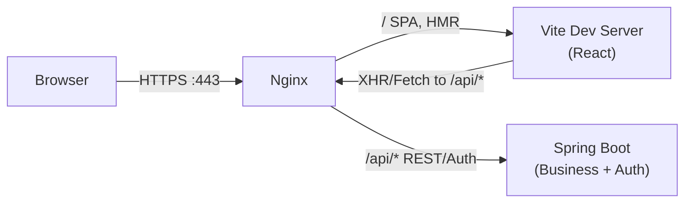
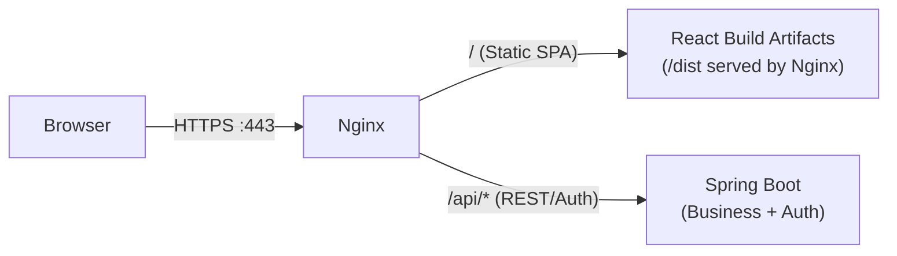

## 1) 환경 구성
### 1.1 OS      : Ubuntu (24.04)
### 1.2 Proxy   : Nginx (1.24)
### 1.3 Frontend: React (19.2.5)
### 1.4 Backend : Spring Boot (2.7.15), JDK (1.8)

## 2) 환경별 구조도
### 2.1 개발


### 2.2 운영


## 3) Nginx Config 설정
### 3.1 개발 환경일 때
```conf
# React Proxy
upstream vite_dev {
  server 127.0.0.1:5173;
}
# Backend Proxy
upstream backend {
  server 127.0.0.1:8080;
}

server {
  listen 443 ssl;
  server_name react-jhlee-local.ymtech.co.kr;

  # SSL
  ssl_certificate     {CRT파일 경로};
  ssl_certificate_key {KEY파일 경로};
  ssl_protocols TLSv1.2 TLSv1.3;

  client_max_body_size 1024G;

  # 1) API -> Backend
  location /api/ {
    proxy_pass http://backend/;

    proxy_http_version 1.1;
    proxy_set_header Host $host;
    proxy_set_header X-Real-IP $remote_addr;
    proxy_set_header X-Forwarded-For $proxy_add_x_forwarded_for;
    proxy_set_header X-Forwarded-Proto $scheme;
  }

  # 2) React Dev -> Vite (HMR WebSocket 포함)
  location / {
    proxy_pass http://vite_dev;

    proxy_http_version 1.1;
    proxy_set_header Host $host;

    proxy_set_header Upgrade $http_upgrade;
    proxy_set_header Connection "upgrade";
  }
}

```


### 3.2 운영 환경일 때
```conf
# Backend Proxy
upstream backend {
  server 127.0.0.1:8080;
}

server {
  listen 443 ssl;
  server_name react-jhlee.ymtech.co.kr;

  ssl_certificate     {CRT파일 경로};
  ssl_certificate_key {KEY파일 경로};
  ssl_protocols TLSv1.2 TLSv1.3;

  client_max_body_size 1024G;
  add_header X-VHOST route-react always;

  root /var/www/team2-react-frontend-sample;
  index index.html;


  # =========================
  # 1) API -> Backend
  # =========================
  location /api/ {
    proxy_pass http://backend/;

    proxy_http_version 1.1;
    proxy_set_header Host $host;
    proxy_set_header X-Real-IP $remote_addr;
    proxy_set_header X-Forwarded-For $proxy_add_x_forwarded_for;
    proxy_set_header X-Forwarded-Proto $scheme;
  }

  # =========================
  # 4) 정적 자산 캐시 (선택)
  # =========================
  location ^~ /assets/ {
    try_files $uri =404;
    expires 30d;
    add_header Cache-Control "public, max-age=2592000, immutable";
  }

  # =========================
  # 5) (선택) 루트(/) 정책
  # =========================
  # 루트로 오면 /dev/로 보내고 싶으면:
  location / {
    try_files $uri $uri/ /index.html;
  }

  # 루트 이하 다른 경로는 404로 막고 싶으면(원하는 정책에 따라):
  # location / {
  #   return 404;
  # }
}

```