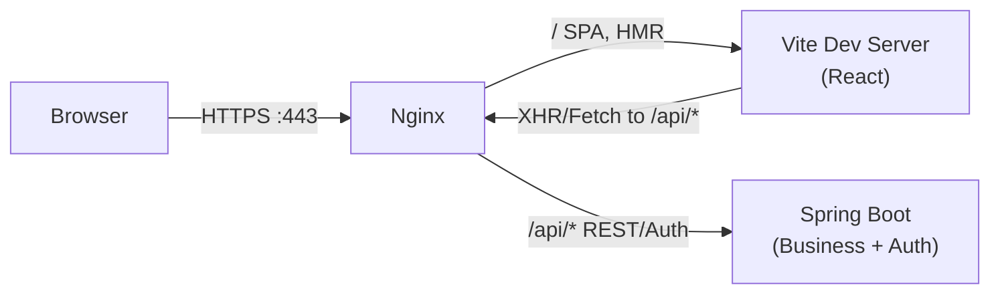
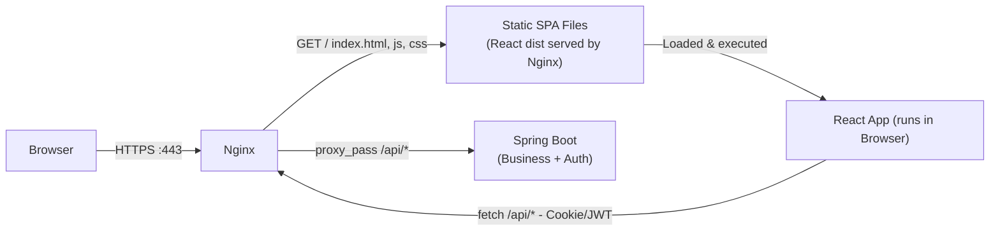

## 1) 환경 구성
### 1.1 OS      : Ubuntu (24.04)
### 1.2 Proxy   : Nginx (1.24)
### 1.3 Frontend: React (19.2.5)
### 1.4 Backend : Spring Boot (2.7.15), JDK (1.8)

## 2) 환경별 구조도
### 2.1 개발


### 2.2 운영


## 3) Nginx Config 설정
파일 경로: /etc/nginx/conf.d/{파일명}.confg

### 3.1 개발 환경일 때
```conf
# React Proxy
upstream vite_dev {
  server 127.0.0.1:5173;
}
# Backend Proxy
upstream backend {
  server 127.0.0.1:8080;
}

server {
  listen 443 ssl;
  server_name react-jhlee-local.ymtech.co.kr;

  # SSL
  ssl_certificate     {CRT파일 경로};
  ssl_certificate_key {KEY파일 경로};
  ssl_protocols TLSv1.2 TLSv1.3;

  client_max_body_size 1024G;

  # 1) API -> Backend
  location /api/ {
    proxy_pass http://backend/;

    proxy_http_version 1.1;
    proxy_set_header Host $host;
    proxy_set_header X-Real-IP $remote_addr;
    proxy_set_header X-Forwarded-For $proxy_add_x_forwarded_for;
    proxy_set_header X-Forwarded-Proto $scheme;
  }

  # 2) React Dev -> Vite (HMR WebSocket 포함)
  location / {
    proxy_pass http://vite_dev;

    proxy_http_version 1.1;
    proxy_set_header Host $host;

    proxy_set_header Upgrade $http_upgrade;
    proxy_set_header Connection "upgrade";
  }
}

```


### 3.2 운영 환경일 때
```conf
# Backend Proxy
upstream backend {
  server 127.0.0.1:8080;
}

server {
  listen 443 ssl;
  server_name react-jhlee.ymtech.co.kr;

  ssl_certificate     {CRT파일 경로};
  ssl_certificate_key {KEY파일 경로};
  ssl_protocols TLSv1.2 TLSv1.3;

  client_max_body_size 1024G;
  add_header X-VHOST route-react always;

  root /var/www/team2-react-frontend-sample;
  index index.html;


  # =========================
  # 1) API -> Backend
  # =========================
  location /api/ {
    proxy_pass http://backend/;

    proxy_http_version 1.1;
    proxy_set_header Host $host;
    proxy_set_header X-Real-IP $remote_addr;
    proxy_set_header X-Forwarded-For $proxy_add_x_forwarded_for;
    proxy_set_header X-Forwarded-Proto $scheme;
  }

  # =========================
  # 4) 정적 자산 캐시 (선택)
  # =========================
  location ^~ /assets/ {
    try_files $uri =404;
    expires 30d;
    add_header Cache-Control "public, max-age=2592000, immutable";
  }

  # =========================
  # 5) (선택) 루트(/) 정책
  # =========================
  location / {
    try_files $uri $uri/ /index.html;
  }
}

```

#### 3.2.1 Nginx Serve 주의 사항
* 정적 결과물 경로
    * /var/wwww/{프로젝트명}
* 왜 하필 /var/www를 많이 쓰나?
    * 역사적으로 Apache/Nginx 같은 웹서버의 정적 컨텐츠 디렉터리로 널리 사용됨
    * 권한/소유자 구성을 하기 쉬움(예: www-data, nginx 사용자)
    * 배포 스크립트/가이드가 대부분 이 경로를 기본으로 설명함
    * nginx 설정에서 root나 alias로 연결하기 편함
* 꼭 /var/www여야 하나요?
    * 아무 경로든 가능하지만 nginx가 그 경로를 읽을 수 있는 권한만 있으면 가능
* 언제 /var/www가 특히 어울리나?
    * 운영에서 React를 npm run build → dist/ 만들어서 nginx가 직접 서빙할 때
    * “웹 컨텐츠”를 OS 관례대로 관리하고 싶을 때
