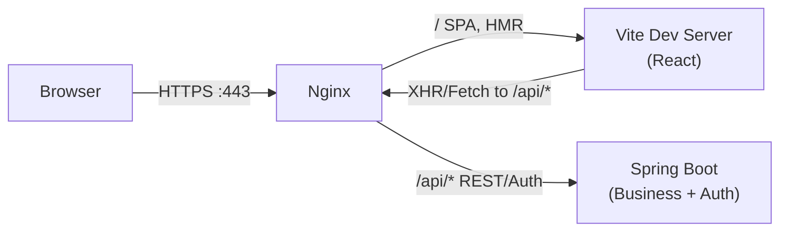
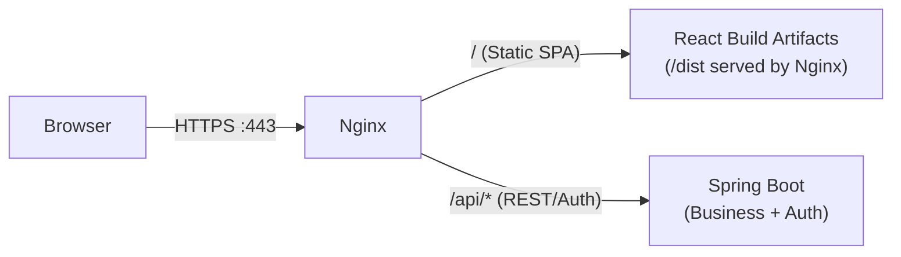

# 환경 구성a
## Proxy   : Nginx
## Frontend: React
## Backend : Spring Boot

### 1) 개발

```mermaid
flowchart LR
  U[Browser] -->|HTTPS :443| N[Nginx]

  N -->|/ SPA, HMR| V["Vite Dev Server<br/>(React)"]
  N -->|/api/* REST/Auth| B["Spring Boot<br/>(Business + Auth)"]

  V -->|XHR/Fetch to /api/*| N
```

### 2) 운영

```mermaid
flowchart LR
  U[Browser] -->|HTTPS :443| N[Nginx]

  N -->|"/ (Static SPA)"| S["React Build Artifacts<br/>(/dist served by Nginx)"]
  N -->|"/api/* (REST/Auth)"| B["Spring Boot<br/>(Business + Auth)"]
```
